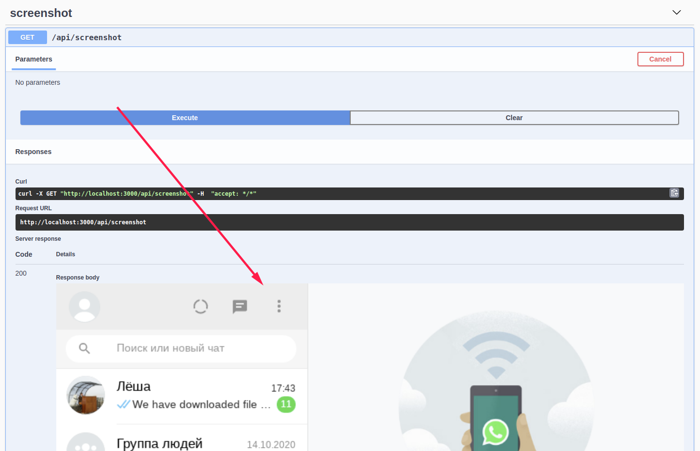

# WhatsApp HTTP API Free

**NOTE**

If you have any problem with docker version of API - try to use the fork https://github.com/diazzaid/whatsapp-api-venom. It uses the latest Venom and probably works better. I haven't updated the venom here for a long time...

----------

WhatsApp HTTP API that you can configure in a click! It's really Free! :)

> The article [Make a WhatsApp Bot Via HTTP API For Free And Fun!](https://allburov.medium.com/make-a-whatsapp-bot-for-free-and-fun-via-http-api-b3e6afcdf395) on Medium about this repository. 

You can go [through currently supported methods in Swagger](https://allburov.github.io/whatsapp-http-api/)
The project is an HTTP wrapper around https://github.com/orkestral/venom, so we can also support these methods:

|                                                            |     |
| ---------------------------------------------------------- | --- |
| Automatic QR Refresh                                       | ✔   |
| Send **text, image, video, audio and docs**                | ✔   |
| Get **contacts, chats, groups, group members, Block List** | ✔   |
| Send contacts                                              | ✔   |
| Send stickers                                              | ✔   |
| Send stickers GIF                                          | ✔   |
| Multiple Sessions                                          | ✔   |
| Forward Messages                                           | ✔   |
| Receive message                                            | ✔   |
| insert user section                                        | ✔   |
| 📍 Send location!!                                         | ✔   |
| 🕸🕸 **and much more**                                       | ✔   |

# Installation

Only thing that you must have - installed docker. Please follow the original
instruction [how to install docker](https://docs.docker.com/get-docker/)

```bash
docker pull allburov/whatsapp-http-api
```

# First Steps

## Run and login

Run WhatsApp HTTP API:

```bash
docker pull allburov/whatsapp-http-api 
docker run -it -v `pwd`/tokens:/app/tokens -p 127.0.0.1:3000:3000/tcp allburov/whatsapp-http-api
```

If you are not logged in, it will print a QR code in the terminal. Scan it with your phone and you are ready to go!
[How to log in - the instruction on WhatsApp site](https://faq.whatsapp.com/general/download-and-installation/how-to-log-in-or-out/?lang=en)
We will remember the session so there is no need to authenticate everytime.

After that open in a browser the link and you'll see Swagger (OpenApi) API specification for WhatsApp HTTP API
http://localhost:3000/#/

## Send a text message

Let's try to send a message:

```bash
# Phone without +
# Using GET
curl "http://localhost:3000/api/sendText?phone=79776772457&text=Hello+from+WhatsApp+HTTP+API+Free!"

# Using POST 
export PHONE=79776772457
curl -d "{\"chatId\": \"${PHONE}@c.us\", \"text\": \"Hello from WhatsApp HTTP API Free\" }" -H "Content-Type: application/json" -X POST http://localhost:3000/api/sendText
```

## Get a screenshot

Go to the "screenshot" section and get a screenshot http://localhost:3000/#/screenshot


## Receive messages

To show how to receive messages we'll create a simple "echo" server with two functions:

1. When we receive a text message - just send the text back
2. When we receive a message with a file (an image, a voice message) - download it and send the path back

In order to send you messages we use webhooks and configure them via environments variables. So what you need to
create "echo" server is HTTP server that will receive JSON POST request and then call back WhatsApp HTTP API
via `POST /api/sendText` endpoint with JSON body.

### Python echo server

We use Python. Feel free to create your favorite language example and contribute to the project!

Run "echo" server in one terminal and leave it working:

```bash
# if you haven't already
git clone https://github.com/allburov/whatsapp-http-api.git 
cd whatsapp-http-api
python -mpip install -r examples/requirements.txt
export FLASK_APP=examples/echo.py
flask run
```

Visit http://localhost:5000 and check that we are good to go further.

Let's start WhatsApp HTTP API and configure the "on message" webhook and point it on our "http://localhost:5000/message"
endpoint:

```bash
docker run -it -v `pwd`/tokens:/app/tokens --network=host -e WHATSAPP_HOOK_ONMESSAGE=http://localhost:5000/message allburov/whatsapp-http-api
```

Now go ahead, open the second whatsapp and send to our WhatsApp HTTP API a text message! It must reply the same text.

If you try to send an image the "echo server" will send a path to the downloaded file.

# Environment variables

## Common

- `DEBUG` - show debug and verbose logs, set in any value
- `WHATSAPP_API_PORT` - listen port for HTTP server (default: `3000`)
- `WHATSAPP_API_HOSTNAME` - Hostname for HTTP server (default: `localhost`)

## Webhooks

The description of [webhooks you can in Venom README.md, section Events](https://github.com/orkestral/venom#events)

All webhooks are disabled by default:

- `WHATSAPP_HOOK_ONMESSAGE=http://localhost/uri`
- `WHATSAPP_HOOK_ONSTATECHANGE=http://localhost/uri`
- `WHATSAPP_HOOK_ONACK=http://localhost/uri`
- `WHATSAPP_HOOK_ONADDEDTOGROUP=http://localhost/uri`

## File storage

- `WHATSAPP_FILES_FOLDER` - folder where will be stored files from chats (images, voice messages) (
  default: `/tmp/whatsapp-files`)
- `WHATSAPP_FILES_MIMETYPES` - download only these mimetypes from messages (download all files be default). Mimetypes
  must be separated by a comma, without spaces: `audio,image/png,image/gif`. In order to choose type use prefix (
  like `audio,image`).
- `WHATSAPP_FILES_LIFETIME`- to keep free space files will be removed after this time (default: `180`, in seconds)

# Development

Use node 10 version:

```bash
$ npm install
```

## Running the app

```bash
# development
$ npm run start

# watch mode
$ npm run start:dev

# production mode
$ npm run start:prod
```

## Test

```bash
# unit tests
$ npm run test

# e2e tests
$ npm run test:e2e

# test coverage
$ npm run test:cov
```
