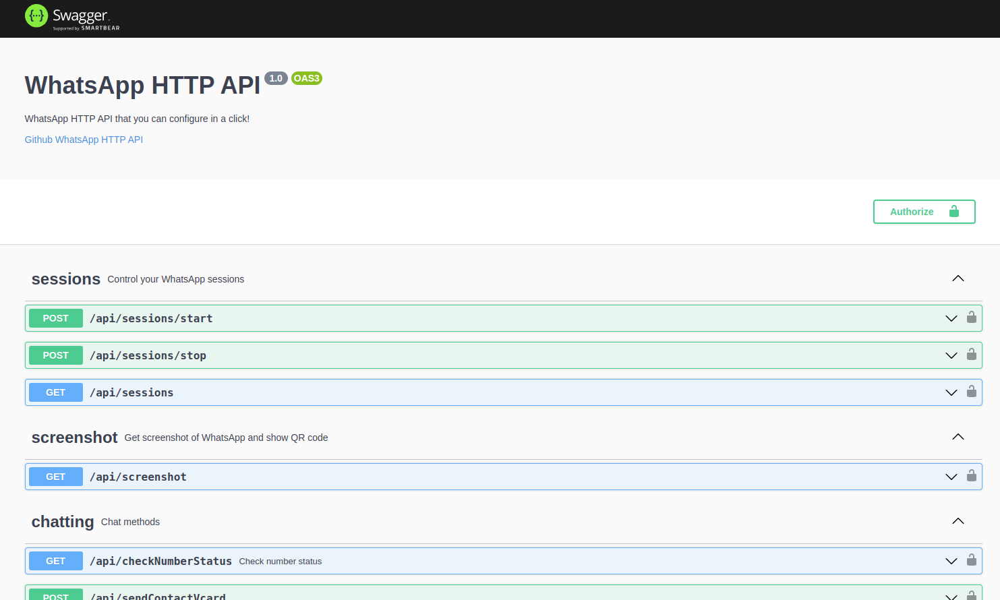
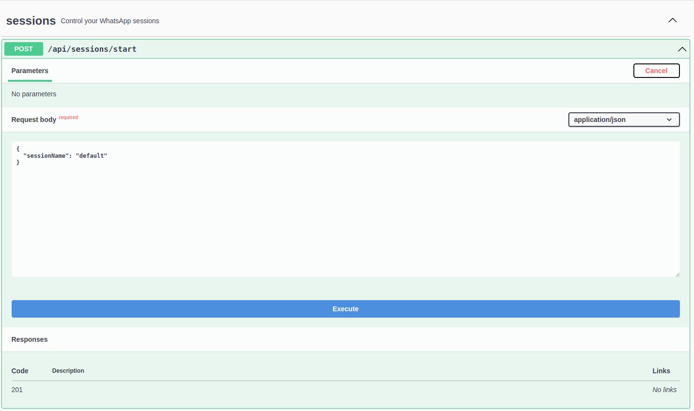
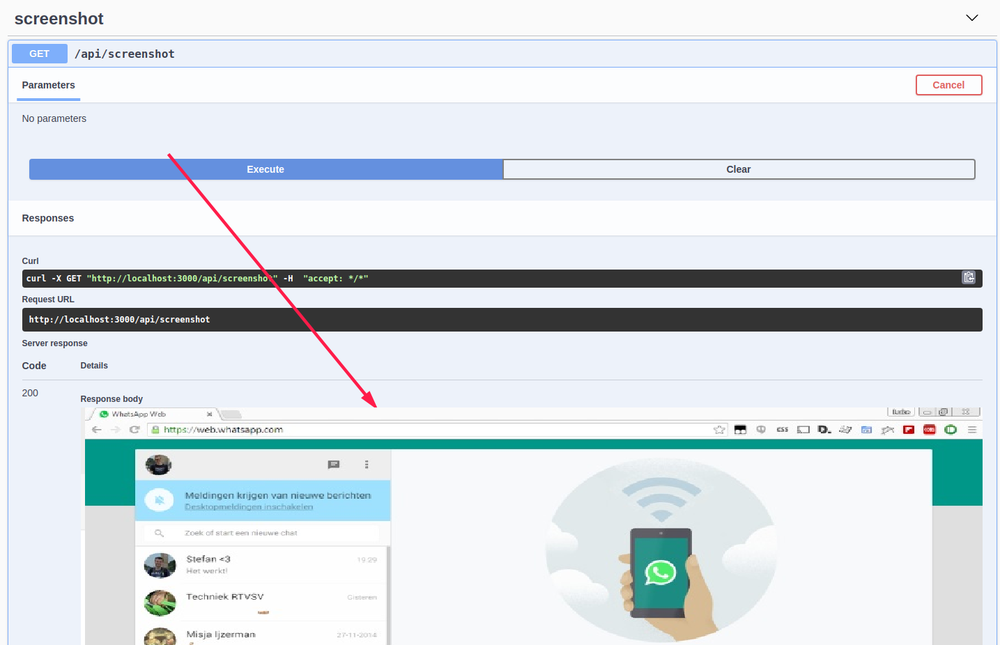
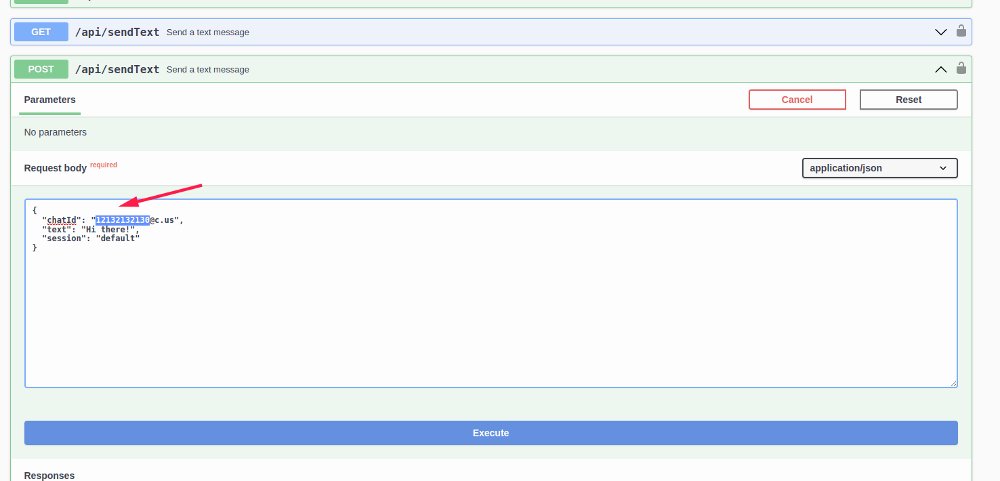

# WhatsApp HTTP API (WAHA)

<p align="center">
    
</p>

**WAHA** - **W**hats**A**pp **H**TTP **A**PI that you can install on your own server and run in less than 5 minutes!

- Documentation: [https://waha.devlike.pro/](https://waha.devlike.pro/)
- Swagger Example: [https://waha.devlike.pro/swagger](https://waha.devlike.pro/swagger)

# Tables of Contents

<!-- toc -->

- [Features](#features)
  * [Messages](#messages)
  * [Sessions](#sessions)
  * [Security](#security)
  * [Updates](#updates)
  * [Groups [soon]](#groups-soon)
  * [Contacts [soon]](#contacts-soon)
- [Quick start](#quick-start)
  * [Requirements](#requirements)
  * [Send your first message](#send-your-first-message)
    + [1. Download image](#1-download-image)
    + [2. Run WhatsApp HTTP API](#2-run-whatsapp-http-api)
    + [3. Start a new session](#3-start-a-new-session)
    + [4. Get and scan QR](#4-get-and-scan-qr)
    + [5. Get the screenshot](#5-get-the-screenshot)
    + [6. Send a text message](#6-send-a-text-message)
  * [What is next?](#what-is-next)

<!-- tocstop -->

# Features

## Messages
- Send messages  
- Receive messages  
- Message replies  
- Send location  
- Send buttons  
- Receive location  
- React to messages  
- Send media (images/documents/files) 
- Send voice messages 
- Receive media (images/audio/video/documents) 
- Receive messages - webhook retries 

## Sessions
- Multi Device  
- Get the screenshot  
- Session saving (don't have to scan QR on every restart) 
- Single WhatsApp account running inside one container 
- Multiple WhatsApp account running inside one container 

## Security
- API authentication 

## Updates
- Bug fixes and updates come as soon as they are implemented. 
- One month delay in bug fixes and updates. 


## Groups [soon]
- Join groups by invite
- Get invite for group
- Modify group info (subject, description)
- Modify group settings (send messages, edit info)
- Add group participants
- Kick group participants
- Promote/demote group participants

## Contacts [soon]
- Mention users
- Mute/unmute chats
- Block/unblock contacts
- Get contact info
- Get profile pictures
- Set user status message

# Quick start

## Requirements

Only thing that you must have - installed docker. Please follow the original
instruction <a href="https://docs.docker.com/get-docker/" target="_blank" rel="noopener">how to install docker -></a>.

When you are ready - come back and follows the below steps to send the first text message to WhatsApp via HTTP API!


Docker makes it easy to ship all-in-one solution with the runtime and dependencies. You don't have to worry about
language-specific libraries or chrome installation.

Also Docker makes installation and update processes so simple, just one command!


## Send your first message

Let's go over steps that allow you to send your first text message via WhatsApp HTTP API!

### 1. Download image

Assuming you have installed [Docker](https://docs.docker.com/get-docker/), let's download the image.

 For Core version the command is

```bash
docker pull devlikeapro/whatsapp-http-api
```

 For Plus version, we use login to get the image before:

```bash
docker login -u devlikeapro -p {PASSWORD}
docker pull devlikeapro/whatsapp-http-api-plus
docker logout
```

Read more about how to get `PASSWORD` for [Plus Version →]()

### 2. Run WhatsApp HTTP API

Run WhatsApp HTTP API:

```bash
docker run -it --rm -p 127.0.0.1:3000:3000/tcp --name whatsapp-http-api devlikeapro/whatsapp-http-api

# It prints logs and the last line must be
# WhatsApp HTTP API is running on: http://[::1]:3000
```

Open the link in your browser [http://localhost:3000/](http://localhost:3000/) and you'll see API documentation
(Swagger).



### 3. Start a new session

To start a new session you should have your mobile phone with installed WhatsApp application close to you.

Please go and read how what we'll need to a bit
later:
<a href="https://faq.whatsapp.com/381777293328336/?helpref=hc_fnav" target="_blank">
How to log in - the instruction on WhatsApp site
</a>

When your ready - find `POST /api/session/start`, click on **Try it out**, then **Execute** a bit below.


The example payload:
```json
{
  "name": "default"
}
```



By using the request with `name` values you can start multiple session (WhatsApp accounts) inside the single docker container in Plus
 version and only one account in Core  version.

Read more about [multiple sessions →]()

### 4. Get and scan QR

Find `GET /api/screenshot` and execute it, it shows you QR code.


**Scan the QR with your cell phone's WhatsApp app.**


### 5. Get the screenshot

Execute `GET /api/screenshot` after a few seconds after scanning the QR - it'll show you the screenshot of you Whatsapp
instance. If you can get the actual screenshot - then you're ready to start sending messages!



### 6. Send a text message

Let's send a text message - find `POST /api/sendText`  in [swagger](http://localhost:3000/) and change `chatId` this
way: use a phone international phone number without `+` symbol and add `@c.us` at the end.

For phone number `12132132131` the `chatId` is  `12132132131@c.us`.

The example payload:
```json
{
  "chatId": "12132132130@c.us",
  "text": "Hi there!",
  "session": "default"
}
```


Also, you can use `curl` and send POST request like this:

```bash
# Phone without +
export PHONE=12132132130
curl -d "{\"chatId\": \"${PHONE}@c.us\", \"text\": \"Hello from WhatsApp HTTP API\" }" -H "Content-Type: application/json" -X POST http://localhost:3000/api/sendText
```

## What is next?
[Go and read the full documentation!](https://waha.devlike.pro/docs/overview/introduction/)

