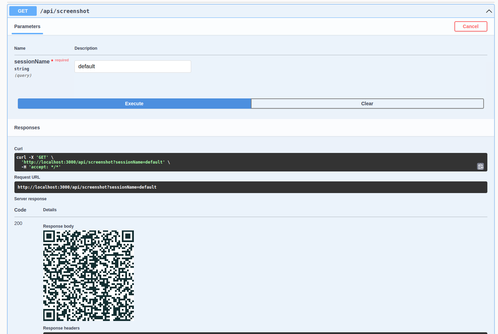

# WhatsApp HTTP API Free

WhatsApp HTTP API that you can configure in a click! It's really Free! :)

The project provides you HTTP API for Whatsapp that you can use to send and receive messages. You can
go [through currently supported methods in Swagger](https://allburov.github.io/whatsapp-http-api/)

The project is an HTTP API wrapper around https://github.com/orkestral/venom

# Tables of Contents

<!-- toc -->

- [Installation](#installation)
- [First Steps](#first-steps)
  * [Run WhatsAPP HTTP API](#run-whatsapp-http-api)
  * [Create a new session and login](#create-a-new-session-and-login)
  * [Send a text message](#send-a-text-message)
- [Receive messages](#receive-messages)
    + [Python echo server](#python-echo-server)
- [Environment variables](#environment-variables)
  * [Common](#common)
  * [Webhooks](#webhooks)
  * [File storage](#file-storage)
- [Support](#support)

<!-- tocstop -->

# Installation

Only thing that you must have - installed docker. Please follow the original
instruction [how to install docker](https://docs.docker.com/get-docker/)

```bash
docker pull allburov/whatsapp-http-api
```

# First Steps

We're going to go through basic steps and send a text message at the end!

## Run WhatsAPP HTTP API

Run WhatsApp HTTP API:

```bash
docker run -it --rm -v `pwd`/tokens:/app/tokens -p 127.0.0.1:3000:3000/tcp --name whatsapp-http-api allburov/whatsapp-http-api

# It prints logs and the last line must be 
# WhatsApp HTTP API is running on: http://[::1]:3000
```

Open the link in your browser: http://localhost:3000/

Note: We don't recommend expose the API outside the world because it does not
support ([yet](https://github.com/allburov/whatsapp-http-api/issues/4)) authorization!

## Create a new session and login

1. To start a new session you should have your mobile phone with installed WhatsApp application close to you. Please go
   and read how what we'll need to a bit
   later: [How to log in - the instruction on WhatsApp site](https://faq.whatsapp.com/381777293328336/?helpref=hc_fnav)
1. Open API documentation at http://localhost:3000/
1. **Start a new session with a name** (you can use `default` for the start)  - find `POST /api/session/start`, click
   on **Try it out**, then **Execute** a bit below.
   
1. **Scan QR Code** - find `GET /api/screenshot` and execute it, it'll show you QR code that you must scan with your
   device.
   
1. **Get a screenshot again** - it'll show you the screenshot of you Whatsapp instance. If you can get the actual
   screenshot - then you're ready to start sending messages!
   

## Send a text message

Let's try to send a message - you can either find `POST /api/sendText`  in swagger (http://localhost:3000/) or
use `curl` or just open a link in a browser (change the phone
before!) http://localhost:3000/api/sendText?phone=79776772457&text=Hello+from+WhatsApp+HTTP+API+Free!

```bash
# Phone without +
# Using GET
curl "http://localhost:3000/api/sendText?phone=79776772457&text=Hello+from+WhatsApp+HTTP+API+Free!"

# Using POST 
export PHONE=79776772457
curl -d "{\"chatId\": \"${PHONE}@c.us\", \"text\": \"Hello from WhatsApp HTTP API Free\" }" -H "Content-Type: application/json" -X POST http://localhost:3000/api/sendText
```

# Receive messages

To show how to receive messages we'll create a simple "echo" server with two functions:

1. When we receive a text message - just send the text back
2. When we receive a message with a file (an image, a voice message) - download it and send the path back

In order to send you messages we use **Webhooks** (look at them below) and configure them via environments variables. So
what you need to
create "echo" server is HTTP server that will receive JSON POST request and then call back WhatsApp HTTP API
via `POST /api/sendText` endpoint with JSON body.

### Python echo server

We use Python. Feel free to create your favorite language example and contribute to the project!

Run "echo" server in one terminal and leave it working:

```bash
# if you haven't already
git clone https://github.com/allburov/whatsapp-http-api.git 
cd whatsapp-http-api
python -mpip install -r examples/requirements.txt
export FLASK_APP=examples/echo.py
flask run
```

Visit http://localhost:5000 and check that we are good to go further.

Let's start WhatsApp HTTP API and configure the "on message" webhook and point it on our "http://localhost:5000/message"
endpoint:

```bash
docker run -it -v `pwd`/tokens:/app/tokens --network=host -e WHATSAPP_HOOK_ONMESSAGE=http://localhost:5000/message allburov/whatsapp-http-api
```

Now go ahead, open the second whatsapp and send to our WhatsApp HTTP API a text message! It must reply the same text.

If you try to send an image the "echo server" will send a path to the downloaded file.

# Environment variables

## Common

- `DEBUG` - show debug and verbose logs, set in any value
- `WHATSAPP_API_PORT` - listen port for HTTP server (default: `3000`)
- `WHATSAPP_API_HOSTNAME` - Hostname for HTTP server (default: `localhost`)
- `WHATSAPP_START_SESSION` - start session with that name right after launching the app

## Webhooks

The description of [webhooks you can in Venom README.md, section Events](https://github.com/orkestral/venom#events)

All webhooks are disabled by default:

- `WHATSAPP_HOOK_ONMESSAGE=http://localhost/uri`
- `WHATSAPP_HOOK_ONSTATECHANGE=http://localhost/uri`
- `WHATSAPP_HOOK_ONACK=http://localhost/uri`
- `WHATSAPP_HOOK_ONADDEDTOGROUP=http://localhost/uri`

## File storage

- `WHATSAPP_FILES_FOLDER` - folder where will be stored files from chats (images, voice messages) (
  default: `/tmp/whatsapp-files`)
- `WHATSAPP_FILES_MIMETYPES` - download only these mimetypes from messages (download all files be default). Mimetypes
  must be separated by a comma, without spaces: `audio,image/png,image/gif`. In order to choose type use prefix (
  like `audio,image`).
- `WHATSAPP_FILES_LIFETIME`- to keep free space files will be removed after this time (default: `180`, in seconds)

# Support

If you want to support the project - you can either:

1. Create a Pull Request for desired functionality
2. Support [the project one time, every month or get access to telegram channel on Boosty](https://boosty.to/allburov)

